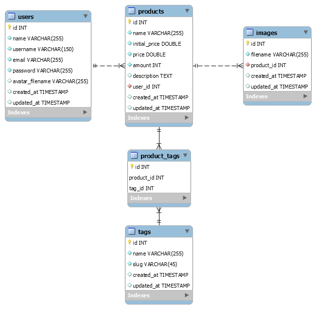

# Hermes: Open Commerce :moneybag: :tada:

> Hermes é o marketplace para comprar e vender uma variedade de produtos! :moneybag: :tada:

> O projeto foi feito totalmente com propositos educacionais e profissionais. Tendo o intuito de provar meus conhecimentos e desenvolver uma solução interessante utilizando o framework PHP [Laravel]('https://laravel.com/) para o problema que foi proposto.

# :pushpin: Tabela de Conteúdos

- [Sobre](#information_source-sobre)
- [Funcionalidades](#bulb-funcionalidades)
- [Requisitos](#construction-requisitos)
- [Instalação](#white_check_mark-instalacao)
- [Inciando](#rocket-iniciando)
- [Tecnologias](#fire-tecnologias)
- [Layouts](#art-layouts)
- [FAQ](#mega-faq)
- [Licença](#pencil-licenca)

# :information_source: Sobre

O Hermes: Open Commerce é uma plataforma de marketplace simples construida com [PHP](https://www.php.net/) utilizando o framework [Laravel](https://laravel.com/) que permite que usuários anunciem produtos que estão vendendo.

## Modelagem do Banco de Dados
A modelagem foi realizada com o [MySQL Workbench](https://www.mysql.com/products/workbench/) e pode ser alterada abrindo o arquivo `.github/docs/database/EER_HERMES.mwb`

# :bulb: Funcionalidades

- [x] :sunglasses: Registro de usuário.
- [x] :lock: Autenticação.
- [x] :gift: Gerenciamento de produtos.

# :construction: Requisitos

- [x] [Git](https://git-scm.com/)
- [x] [PHP](https://www.php.net/)
- [x] [Composer]('https://getcomposer.org/')
- [x] [Node.js](https://nodejs.org/en/)
- [x] [Navegador Web Moderno](https://brave.com/)

# :white_check_mark: Instalação

**Primeiramente verifique se você possui todos os requisitos acima e então clone este repositória via:**

- Usando protocolo HTTP:

  - `git clone https://github.com/Yuziem14/hermes-opencommerce.git`

- Using SSH protocol:
  - `git clone git@github.com:Yuziem14/hermes-opencommerce.git`

_Obs: Somente clone com SSH se você já possuir uma chave de segurança SSH configurada._

# :rocket: Iniciando
1. Primeiramente, execute: `cd ./src` para entrar no diretório da aplicação.
1. Execute `composer install` para instalar as dependências do Laravel.
1. Execute `cp .env.example .env` para copiar o arquivo de ambiente ou o faça manualmente.
1. Execute `php artisan key:generate` para gerar a chave de segurança da aplicação.
1. Configure o arquivo `.env`
1. Execute `php artisan migrate` para criar as tabelas do banco de dados.
1. Execute `php artisan storage:link` para criar um link simbólico do diretório `storage` para o `public`.

**Para executar o próximo passo é necessário ter o [Node.js e o NPM](https://nodejs.org/en/) instalado. Caso não tenha vá direto para o passo 9.**

1. Execute `npm install` para instalar as dependencias do Node.
2. Execute `npm run dev` para compilar os assets de CSS, JS e copiar imagens para o diretório `public`.
   
**Caso não queira configurar o Node.js, siga os seguintes passos:**

9. Extraia do arquivo `./.github/assets.zip` os diretórios `css`, `js`, `images`.
1. Adicione os diretórios `css`, `js`, `images` na raiz do diretório `public`.
1. Por fim `php artisan serve` para iniciar o servidor da aplicação.

> _Obs: Caso queira, use o yarn ao invés do npm._

## :warning: Importante

> #### O banco de dados usado por padrão é o [PostgreSQL](https://www.postgresql.org/). Para que ele possa ser usado é necessário habilitar as extensões do PHP referentes ao driver de conexão com o Postgres. Saiba mais sobre como [utilizar o Postgres  com PHP](https://medium.com/@hdeodato/utilizar-postgres-com-php-212eb4644dce).
>
> #### Felizmente, o Laravel nos permite mudar de banco facilmente. Então caso não queira configurar o PostgreSQL basta configurar o arquivo .env para utilizar outro banco como MySQL ou SQLite.

# :fire: Tecnologias

O projeto foi construído com:

- [PHP](https://www.php.net/) + [Laravel](https://laravel.com/)
- [HTML (Blade Template)](https://laravel.com/docs/8.x/blade) + [CSS](https://developer.mozilla.org/pt-BR/docs/Web/CSS) + [JS]()
- [PostgreSQL](https://www.postgresql.org/)

# :art: Layout

> [Acesse o Layout do Projeto.](https://www.figma.com/file/31fU9WfNGloZVyIRjocaUO/Hermes-Open-Commerce)

A prototipação e design desse projeto foi construído na ferramenta [Figma](https://www.figma.com/).

Tu pode duplicar esse layout para a sua conta do Figma e modificar a vontade :pray:

# :mega: FAQ
_1. Da onde surgiu o nome desse projeto?_
  - A minha solução era criar um marketplace aberto onde as pessoas poderiam anunciar os produtos que quisessem, ou seja um "livre comércio" por isso "Open Commerce". Além disso **[Hermes](https://pt.wikipedia.org/wiki/Hermes)** é um deus mitologico grego o qual é aclamdo por suas dádivas de negociação, comercialização sendo ele também o mensageiro dos deuses.
# :pencil: Licença

Leia [Licença](LICENSE.md) para esse projeto.

---

> _Feito com :purple_heart: por Yuri Ziemba._